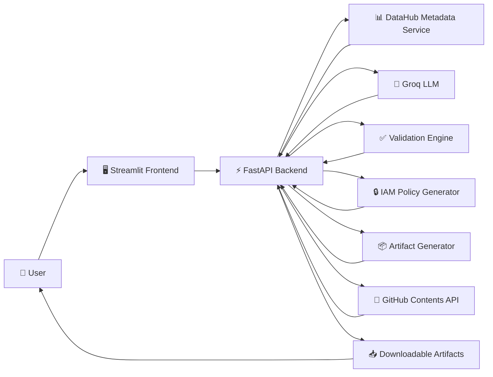
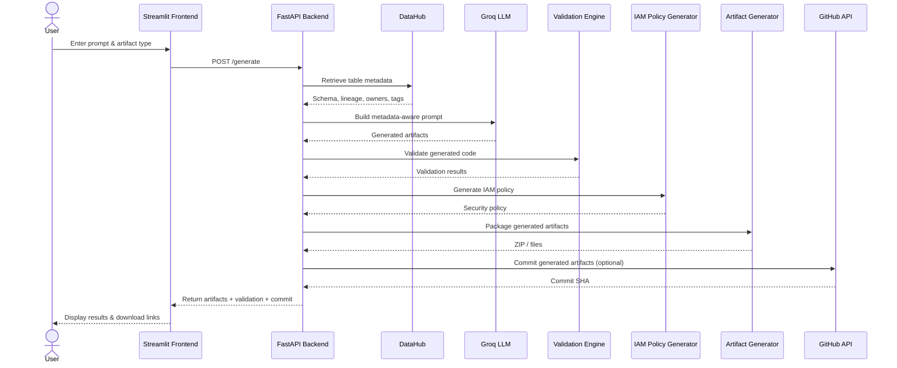

# 🚀 AI Data Pipeline Generator

> AI-powered platform for generating production-ready data engineering pipelines from metadata and natural language.

---

## Table of Contents

- Overview
- Problem Statement
- Features
- Architecture
- System Workflow
- Tech Stack
- Design Decisions
- Installation
- Configuration
- Running the Application
- API Reference
- Example Usage
- Screenshots
- Project Structure
- Security
- Validation
- Deployment
- CI/CD
- Roadmap
- Contributing
- License
- Author

---

## Overview

**AI Data Pipeline Generator** is an AI-powered platform that transforms natural language requests into production-ready data engineering artifacts. By combining enterprise metadata from **DataHub** with Large Language Models (LLMs), the application generates complete, validated pipeline components that accelerate modern data engineering workflows.

Instead of manually writing Airflow DAGs, SQL transformations, dbt models, YAML configurations, and deployment documentation, users simply describe the pipeline they want to build. The platform retrieves metadata for the target dataset, enriches the AI prompt with schema information, validates the generated output, packages the artifacts, and optionally commits them directly to GitHub.

Designed for data engineers, analytics engineers, DevOps engineers, and platform teams, the project demonstrates how metadata-driven AI can reduce repetitive engineering tasks while encouraging consistency, security, and production-ready best practices.

### Key Capabilities

- Generate complete data engineering pipelines from natural language.
- Retrieve dataset metadata directly from DataHub.
- Produce production-ready Airflow DAGs.
- Generate SQL transformations and dbt models.
- Create YAML configuration files and project documentation.
- Validate generated artifacts before delivery.
- Generate least-privilege IAM security policies.
- Package artifacts into downloadable ZIP archives.
- Commit generated artifacts directly to GitHub using the GitHub Contents API.
- Deploy as a cloud-native application using FastAPI, Streamlit, and Render.


## Problem Statement

Modern data engineering involves building and maintaining a wide variety of pipeline components, including workflow orchestration, SQL transformations, configuration files, security policies, documentation, and deployment assets. Although these artifacts often follow established patterns, they are still created manually, resulting in repetitive work, inconsistent implementations, and slower development cycles.

At the same time, organizations increasingly rely on metadata platforms such as DataHub to maintain accurate information about datasets, schemas, ownership, lineage, and governance. However, this valuable metadata is rarely integrated into the software development process, forcing engineers to manually reference schemas while writing pipelines.

Recent advances in Large Language Models (LLMs) have demonstrated their ability to generate code from natural language. However, generic AI-generated code often lacks awareness of an organization's actual metadata, governance requirements, and production standards, making the generated output unreliable without additional context and validation.

The AI Data Pipeline Generator addresses these challenges by combining enterprise metadata with AI-assisted code generation. Instead of generating generic templates, the platform enriches AI prompts using metadata retrieved from DataHub, validates the generated artifacts, produces supporting security policies, packages the results for delivery, and optionally commits the generated assets directly to GitHub.

By reducing repetitive engineering work while leveraging trusted metadata, the platform enables engineers to prototype, validate, and deliver production-ready data pipeline components significantly faster.


## Features

The AI Data Pipeline Generator combines enterprise metadata, artificial intelligence, and cloud-native tooling to automate the generation of production-ready data engineering artifacts.

### 🤖 AI-Powered Code Generation

- Generate production-ready Airflow DAGs from natural language.
- Generate SQL transformations using dataset metadata.
- Generate dbt models following analytics engineering best practices.
- Generate YAML configuration files for pipeline configuration.
- Generate project documentation and README files automatically.
- Generate complete end-to-end pipeline packages with a single request.

---

### 📊 Metadata Integration

- Retrieve dataset metadata directly from DataHub.
- Incorporate schema, column definitions, ownership, tags, and lineage into AI prompts.
- Produce metadata-aware artifacts instead of generic code templates.

---

### 🛡 Security & Governance

- Generate least-privilege AWS IAM policies.
- Validate generated artifacts before delivery.
- Encourage production-ready engineering practices.
- Support metadata-driven governance.

---

### ⚙ Pipeline Automation

- Package generated artifacts into downloadable ZIP archives.
- Support generation of individual artifacts or complete pipelines.
- Generate reusable project assets with consistent structure.

---

### ☁ Cloud-Native Deployment

- FastAPI backend for REST API services.
- Streamlit frontend for an interactive user experience.
- Deployed using Render.
- CI/CD powered by GitHub Actions.

---

### 🔗 GitHub Integration

- Upload generated artifacts directly to GitHub.
- Automatically create commits through the GitHub Contents API.
- Return commit hashes for traceability.

---

### ✅ Developer Experience

- Simple natural language interface.
- Interactive metadata explorer.
- Download generated artifacts directly from the browser.
- Modular project structure for easy extension.
- Designed as a portfolio-ready and production-inspired application.


## Architecture

The AI Data Pipeline Generator follows a modular, service-oriented architecture that separates user interaction, pipeline generation, metadata retrieval, validation, and artifact management into independent components.

A user submits a natural language request through the Streamlit frontend. The FastAPI backend orchestrates the workflow by retrieving metadata from DataHub, constructing an enriched prompt, invoking the Large Language Model (LLM), validating the generated artifacts, generating supporting security policies, packaging the outputs, optionally committing them to GitHub, and returning the results to the user.



### Architecture Components

| Component | Responsibility |
|------------|----------------|
| **Streamlit Frontend** | Provides an interactive interface for metadata exploration and AI pipeline generation. |
| **FastAPI Backend** | Coordinates the complete generation workflow and exposes REST API endpoints. |
| **DataHub** | Supplies dataset metadata including schema, ownership, tags, and lineage. |
| **Groq LLM** | Generates production-ready pipeline artifacts using metadata-aware prompts. |
| **Validation Engine** | Verifies generated outputs before they are returned to the user. |
| **IAM Policy Generator** | Produces least-privilege AWS IAM policies alongside generated pipelines. |
| **Artifact Generator** | Packages generated files into downloadable ZIP archives or individual artifacts. |
| **GitHub API** | Uploads generated artifacts to the repository and returns commit hashes for traceability. |


## System Workflow

The AI Data Pipeline Generator follows a metadata-driven workflow that combines enterprise metadata, artificial intelligence, validation, security analysis, and artifact packaging into a single automated pipeline.

Each generation request passes through multiple stages before the final artifacts are delivered to the user.



---

### Workflow Stages

#### 1. User Request

The workflow begins when a user submits a natural language request describing the desired pipeline or artifact.

Examples include:

- Generate an Airflow DAG for the `fct_users_created` table.
- Generate SQL to count daily active users.
- Generate a complete production pipeline.

---

#### 2. Metadata Retrieval

The backend queries DataHub to retrieve metadata for the requested dataset, including:

- Column names
- Data types
- Ownership
- Tags
- Dataset lineage

This metadata is used to enrich the AI prompt, ensuring generated artifacts accurately reflect the underlying data model.

---

#### 3. AI Generation

The enriched prompt is sent to the Large Language Model (LLM), which generates one or more production-ready artifacts, such as:

- Airflow DAGs
- SQL scripts
- dbt models
- YAML configuration files
- Project documentation

---

#### 4. Validation

Generated artifacts are automatically validated to ensure they satisfy expected structural and formatting requirements before being returned to the user.

---

#### 5. Security Policy Generation

The application generates a least-privilege AWS IAM policy tailored to the generated pipeline, promoting secure deployment practices.

---

#### 6. Artifact Packaging

Depending on the selected generation mode, the system either:

- returns a single generated artifact, or
- packages multiple artifacts into a downloadable ZIP archive.

---

#### 7. GitHub Integration

If GitHub integration is enabled, generated artifacts are uploaded to the configured repository using the GitHub Contents API.

The resulting commit SHA is returned to the frontend to provide traceability for generated outputs.

---

#### 8. Delivery

Finally, the frontend presents:

- Generated artifacts
- Validation results
- Security policy
- Download links
- GitHub commit hash (when available)

allowing users to immediately inspect, download, or integrate the generated assets into their workflow.


## Tech Stack

The AI Data Pipeline Generator is built using a modern, cloud-native technology stack designed for rapid AI development, modularity, scalability, and maintainability.

| Category | Technology | Purpose |
|-----------|------------|---------|
| **Programming Language** | Python 3.11 | Primary language for backend services and AI orchestration. |
| **Backend Framework** | FastAPI | High-performance REST API framework used to orchestrate pipeline generation. |
| **Frontend** | Streamlit | Interactive web interface for metadata exploration and pipeline generation. |
| **AI / LLM** | Groq API | Generates production-ready data engineering artifacts using metadata-aware prompts. |
| **Metadata Platform** | DataHub | Supplies dataset metadata, schemas, lineage, ownership, and governance information. |
| **Version Control** | Git & GitHub | Source control and collaborative software development. |
| **GitHub Integration** | GitHub Contents API | Uploads generated artifacts directly into repository commits. |
| **Deployment** | Render | Cloud platform hosting the FastAPI backend. |
| **Frontend Hosting** | Streamlit Community Cloud / Local | Hosts the user interface for interacting with the platform. |
| **Validation** | Custom Validation Engine | Verifies generated artifacts before delivery. |
| **Security** | IAM Policy Generator | Produces least-privilege AWS IAM policies alongside generated pipelines. |
| **Packaging** | Python ZipFile | Bundles multiple generated artifacts into downloadable ZIP archives. |
| **Environment Management** | python-dotenv | Secure loading of environment variables and API credentials. |
| **HTTP Client** | Requests | Communicates with external APIs including DataHub, GitHub, and Groq. |
| **Continuous Integration** | GitHub Actions | Executes automated tests and validates code changes before merging. |

### Why These Technologies?

The project intentionally combines technologies commonly used in modern data engineering and cloud-native software development.

- **FastAPI** was selected for its asynchronous performance, automatic OpenAPI documentation, and clean dependency injection model.
- **Streamlit** enables rapid development of an intuitive frontend without requiring a dedicated JavaScript framework.
- **DataHub** provides enterprise metadata that improves the accuracy and relevance of AI-generated artifacts.
- **Groq** offers low-latency inference, enabling fast generation of production-ready pipeline components.
- **GitHub Contents API** enables generated artifacts to be version-controlled immediately after creation.
- **Render** provides a lightweight cloud deployment platform suitable for containerized Python applications.


## Design Decisions

The architecture of the AI Data Pipeline Generator was guided by principles of modularity, maintainability, and production-inspired software engineering. Rather than optimizing solely for rapid prototyping, the project was designed to demonstrate how AI, metadata platforms, cloud-native services, and modern APIs can be integrated into a cohesive data engineering workflow.

### FastAPI Instead of Flask

FastAPI was selected as the backend framework because it provides:

- High-performance asynchronous request handling.
- Automatic OpenAPI documentation.
- Strong type validation using Pydantic.
- Modern dependency injection patterns.
- Excellent support for REST API development.

These capabilities make FastAPI well-suited for orchestrating multiple external services, including DataHub, Groq, and the GitHub API.

---

### Streamlit Instead of a JavaScript Frontend

Rather than introducing a dedicated frontend framework such as React or Vue, Streamlit was chosen to prioritize rapid development and experimentation.

Benefits include:

- Minimal frontend boilerplate.
- Native Python development.
- Fast iteration during AI workflow development.
- Easy deployment for demonstration and portfolio purposes.

This decision allows development effort to focus on backend architecture and AI orchestration rather than frontend complexity.

---

### Metadata-Driven AI Generation

Large Language Models perform significantly better when provided with structured context.

Instead of relying solely on user prompts, the platform retrieves metadata from DataHub, including:

- Dataset schemas
- Column definitions
- Ownership information
- Tags
- Lineage

This metadata is incorporated into prompt construction, enabling the AI to generate artifacts that more closely reflect the underlying data model.

---

### Validation Before Delivery

AI-generated code is not automatically assumed to be production-ready.

Every generation request passes through a validation stage before results are returned to the user.

This design helps improve consistency while encouraging responsible AI-assisted software generation.

---

### GitHub as the Source of Truth

Generated artifacts can be committed directly to GitHub using the GitHub Contents API.

This approach provides:

- Version history
- Auditability
- Traceability
- Collaboration
- Repository-backed artifact storage

Rather than existing only temporarily within the application, generated outputs become part of a version-controlled software development workflow.

---

### Modular Project Structure

The application is organized into independent modules responsible for:

- Metadata retrieval
- Prompt engineering
- AI generation
- Validation
- Security policy generation
- GitHub integration
- Artifact packaging

This separation of concerns improves maintainability and simplifies future feature development.

---

### Security by Design

Security considerations were incorporated throughout the project.

Examples include:

- Least-privilege IAM policy generation.
- Environment variable management using `.env`.
- GitHub Personal Access Token authentication.
- Validation before artifact delivery.
- Repository-based version control for generated assets.

---

### Cloud-Native Architecture

The application was designed around independently deployable components.

- FastAPI serves backend APIs.
- Streamlit provides the frontend.
- Render hosts backend services.
- GitHub Actions automates continuous integration.
- GitHub serves as the artifact repository.

This modular architecture allows components to evolve independently while remaining loosely coupled.


## Installation

### Prerequisites

Before installing the project, ensure the following software is available on your system.

| Requirement | Recommended Version |
|-------------|---------------------|
| Python | 3.11+ |
| Git | Latest |
| pip | Latest |
| Virtual Environment | venv |
| DataHub (Optional) | Latest |
| GitHub Account | Required for GitHub integration |

---

### Clone the Repository

```bash
git clone https://github.com/pmman-sudo/AI-Data-Pipeline-Generator.git

cd AI-Data-Pipeline-Generator
```

---

### Create a Virtual Environment

Linux / macOS

```bash
python3 -m venv venv

source venv/bin/activate
```

Windows

```powershell
python -m venv venv

venv\Scripts\activate
```

---

### Install Dependencies

```bash
pip install -r requirements.txt
```

---

### Verify Installation

Confirm that the backend dependencies were installed correctly.

```bash
python -c "import fastapi; print('FastAPI Installed')"
```

Confirm the frontend dependencies.

```bash
python -c "import streamlit; print('Streamlit Installed')"
```

---

### Project Setup Complete

Once these steps have completed successfully, continue to the **Configuration** section to configure API keys and environment variables.


## Configuration

The AI Data Pipeline Generator uses environment variables to securely manage API keys, service endpoints, and application configuration.

Create a file named **`.env`** in the project root.

```text
AI-Data-Pipeline-Generator/
│
├── app/
├── generated/
├── tests/
├── streamlit_app.py
├── requirements.txt
└── .env
```

---

### Example `.env`

```env
# ==============================
# Groq API
# ==============================
GROQ_API_KEY=your_groq_api_key

# ==============================
# GitHub Integration
# ==============================
GITHUB_TOKEN=your_github_personal_access_token

# ==============================
# DataHub
# ==============================
DATAHUB_GMS=http://localhost:8080

# ==============================
# Application
# ==============================
ENVIRONMENT=development
```

---

### Environment Variables

| Variable | Required | Description |
|----------|----------|-------------|
| `GROQ_API_KEY` | ✅ | API key used to generate AI-powered pipeline artifacts. |
| `GITHUB_TOKEN` | ✅ | Personal Access Token used to upload generated artifacts to GitHub. |
| `DATAHUB_GMS` | Optional | URL of the DataHub Metadata Service (GMS). If omitted, metadata write-back is skipped. |
| `ENVIRONMENT` | Optional | Application environment (e.g., `development`, `production`). |

---

### Creating a GitHub Personal Access Token

To enable automatic commits of generated artifacts:

1. Log in to GitHub.
2. Open **Settings → Developer settings → Personal access tokens**.
3. Generate a new token.
4. Grant the required repository permissions.
5. Copy the generated token.
6. Set the token as the value of `GITHUB_TOKEN` in your `.env` file.

---

### Obtaining a Groq API Key

1. Create a Groq account.
2. Generate an API key from the Groq dashboard.
3. Add the key to the `.env` file as:

```env
GROQ_API_KEY=your_api_key
```

---

### Configuring DataHub (Optional)

If a DataHub instance is available, configure the Metadata Service endpoint:

```env
DATAHUB_GMS=http://localhost:8080
```

If no DataHub instance is configured, the application continues to function, but metadata write-back features will be disabled.

---

### Security Best Practices

- Never commit `.env` files to version control.
- Rotate API keys if they are accidentally exposed.
- Use repository secrets for CI/CD pipelines.
- Grant GitHub Personal Access Tokens only the minimum permissions required.
- Store production credentials using your deployment platform's secret management system rather than directly in source code.

## Running the Application

Once the project has been installed and configured, start the backend and frontend services.

---

### Step 1 — Start the FastAPI Backend

From the project root, run:

```bash
uvicorn app.main:app --reload
```

The backend will be available at:

```
http://localhost:8000
```

Interactive API documentation can be accessed at:

```
http://localhost:8000/docs
```

Alternative OpenAPI documentation:

```
http://localhost:8000/redoc
```

---

### Step 2 — Start the Streamlit Frontend

Open a second terminal window.

Activate the virtual environment if it is not already active.

Run:

```bash
streamlit run streamlit_app.py
```

The frontend will be available at:

```
http://localhost:8501
```

---

### Step 3 — Verify Backend Connectivity

When the Streamlit application loads, it automatically checks the backend health endpoint.

A successful connection displays:

```
✅ Backend Connected
```

If the backend is unavailable, the application displays:

```
❌ Cannot connect to FastAPI backend
```

Ensure the FastAPI server is running before using the frontend.

---

### Step 4 — Generate a Pipeline

1. Enter the target DataHub table name.

Example:

```
fct_users_created
```

2. Select an artifact type.

Available options include:

- Generate Complete Pipeline
- Airflow DAG
- SQL
- dbt
- YAML
- README

3. Describe the pipeline to generate.

Example:

```
Generate an Airflow DAG that ingests the
fct_users_created table every day at midnight.
```

4. Click **Generate Pipeline**.

---

### Step 5 — Review the Results

After generation completes, the application displays:

- Generated artifact(s)
- Validation results
- Generated IAM security policy
- GitHub commit hash (if enabled)
- Download link for generated files

For complete pipeline generation, a downloadable ZIP archive containing all generated artifacts is provided.

---

### Expected Startup Architecture

```text
                    User
                      │
                      ▼
          Streamlit Frontend
          http://localhost:8501
                      │
        HTTP Requests │
                      ▼
             FastAPI Backend
          http://localhost:8000
                      │
      ┌───────────────┼────────────────┐
      ▼               ▼                ▼
  DataHub         Groq LLM       GitHub API
      │               │                │
      └───────────────┼────────────────┘
                      ▼
            Generated Artifacts
```

---

### Stopping the Application

To stop either service, press:

```text
Ctrl + C
```

in the corresponding terminal.

---

### Troubleshooting

#### Backend Not Running

Verify that the FastAPI application has started successfully.

```bash
uvicorn app.main:app --reload
```

---

#### Streamlit Cannot Connect

Confirm that:

- FastAPI is running.
- `API_URL` points to the correct backend.
- Firewall settings are not blocking localhost connections.

---

#### GitHub Commits Not Appearing

Verify:

- `GITHUB_TOKEN` is configured.
- The Personal Access Token has repository permissions.
- The configured repository owner and branch are correct.

---

#### DataHub Metadata Unavailable

If DataHub is not running, the application will still generate artifacts using the provided prompt, but metadata-aware generation and metadata write-back features will be unavailable.

## API Reference

The FastAPI backend exposes RESTful endpoints for metadata retrieval, AI-powered artifact generation, health monitoring, and artifact downloads.

The interactive API documentation is automatically generated by FastAPI and is available at:

```
http://localhost:8000/docs
```

Alternative documentation:

```
http://localhost:8000/redoc
```

---

# Base URL

Local Development

```
http://localhost:8000
```

Production (Example)

```
https://your-render-backend.onrender.com
```

---

# Endpoints

## Health Check

Verifies that the backend service is running.

### Request

```http
GET /health
```

### Response

```json
{
  "status": "ok"
}
```

### Status Codes

| Code | Description |
|------|-------------|
| 200 | Backend is healthy |

---

## Retrieve Dataset Metadata

Retrieves metadata for a DataHub dataset.

### Request

```http
GET /schema/{table_name}
```

### Example

```http
GET /schema/fct_users_created
```

### Example Response

```json
{
  "columns": [...],
  "owners": [...],
  "tags": [...],
  "lineage": [...]
}
```

### Status Codes

| Code | Description |
|------|-------------|
| 200 | Metadata successfully retrieved |
| 404 | Dataset not found |
| 500 | Internal server error |

---

## Generate Pipeline

Generates one or more production-ready pipeline artifacts using AI.

### Request

```http
POST /generate
```

### Request Body

```json
{
  "task": "Generate an Airflow DAG for the fct_users_created table.",
  "artifact_type": "airflow"
}
```

### Parameters

| Field | Type | Description |
|--------|------|-------------|
| task | string | Natural language description of the requested artifact. |
| artifact_type | string | Artifact type to generate (`airflow`, `sql`, `dbt`, `yaml`, `readme`, or `all`). |

### Example Response

```json
{
  "artifact": "generated/sql/example.sql",
  "security_policy": "generated/iam_policies/example_policy.json",
  "validation": {
    "status": "pass",
    "details": "Validation successful"
  },
  "commit": "430c9a4"
}
```

### Status Codes

| Code | Description |
|------|-------------|
| 200 | Generation successful |
| 400 | Invalid request |
| 500 | Generation failed |

---

## Download Generated Artifact

Downloads an artifact generated by the backend.

### Request

```http
GET /download?path=<artifact_path>
```

### Example

```http
GET /download?path=generated/sql/example.sql
```

### Response

Returns the requested file for download.

### Status Codes

| Code | Description |
|------|-------------|
| 200 | File downloaded |
| 404 | File not found |

---

# Error Response Format

When an operation fails, the API returns an error response similar to:

```json
{
  "detail": "Unable to generate artifact."
}
```

---

# Authentication

At present, the public API does not require user authentication.

However, integrations with external services use secure credentials stored as environment variables:

- `GROQ_API_KEY`
- `GITHUB_TOKEN`
- `DATAHUB_GMS`

These credentials are never exposed to the frontend.

---

# OpenAPI Documentation

Because the backend is built with FastAPI, complete OpenAPI documentation is automatically generated.

Developers can explore endpoints, request schemas, and responses interactively using:

```
/docs
```

or

```
/redoc
```


## Example Usage

The following example demonstrates a complete workflow using the AI Data Pipeline Generator.

---

### Scenario

A data engineer wants to generate a production-ready Airflow pipeline for the `fct_users_created` dataset stored in DataHub.

---

### Step 1 — Enter Dataset

In the **Metadata Explorer**, specify the DataHub table.

```
fct_users_created
```

Click **Preview Metadata** to retrieve the dataset schema.

The application displays:

- Column definitions
- Dataset owners
- Tags
- Lineage information

---

### Step 2 — Select Artifact Type

Choose the desired output.

```
Generate Complete Pipeline
```

This generates:

- Airflow DAG
- SQL
- dbt model
- YAML configuration
- README
- IAM Policy
- Validation report
- ZIP package

---

### Step 3 — Enter Prompt

Example prompt:

```text
Generate a production-ready Airflow DAG that ingests the
fct_users_created table every day at midnight.

Include retries, logging, monitoring,
and best practices for production deployment.
```

---

### Step 4 — Generate Pipeline

Click:

```
🚀 Generate Pipeline
```

The backend performs the following operations:

1. Retrieves metadata from DataHub.
2. Constructs a metadata-aware prompt.
3. Sends the prompt to the Groq LLM.
4. Validates generated artifacts.
5. Generates an IAM security policy.
6. Packages the artifacts.
7. Uploads the artifacts to GitHub (if enabled).

---

### Example Response

```text
✅ Pipeline generated successfully

Generated Artifact
generated/fct_users_created_pipeline.zip

Validation
PASS

Git Commit
430c9a4
```

---

### Example Generated Artifacts

```text
generated/

├── airflow/
│   └── fct_users_created_dag.py
│
├── sql/
│   └── fct_users_created.sql
│
├── dbt/
│   └── fct_users_created.sql
│
├── yaml/
│   └── pipeline.yaml
│
├── readme/
│   └── README.md
│
├── iam_policies/
│   └── fct_users_created_policy.json
│
├── validation/
│   └── validation.json
│
└── fct_users_created_pipeline.zip
```

---

### Example Validation Output

```json
{
  "status": "pass",
  "details": "5 artifacts generated successfully."
}
```

---

### Example GitHub Commit

```text
430c9a4
```

The generated artifacts are committed directly to the configured GitHub repository, providing version history and traceability.

---

### Alternative Example Prompts

#### Generate SQL

```text
Generate SQL that counts new users created each day.
```

---

#### Generate dbt Model

```text
Generate a dbt model for the
fct_users_created table using best practices.
```

---

#### Generate Airflow DAG

```text
Generate a production-ready Airflow DAG
scheduled to run every day at midnight.
```

---

#### Generate YAML Configuration

```text
Generate a YAML configuration
for the pipeline deployment.
```

---

#### Generate Project Documentation

```text
Generate comprehensive project documentation
for this data pipeline.
```

---

### Expected Outputs

Depending on the selected artifact type, the application may produce:

| Artifact | Description |
|----------|-------------|
| Airflow DAG | Production-ready workflow orchestration |
| SQL | Analytics or transformation queries |
| dbt Model | dbt-compatible SQL model |
| YAML | Configuration files |
| README | Automatically generated documentation |
| IAM Policy | Least-privilege AWS security policy |
| Validation Report | Validation status and details |
| ZIP Package | Bundled artifacts for download |
| GitHub Commit | Commit SHA for uploaded artifacts |


## 📸 Screenshots


### 1. Dashboard


The main interface of the AI Data Pipeline Generator showing backend connectivity, and metadata exploration.


---


### 2. Metadata Explorer


Browse available DataHub metadata and select a dataset before generating pipeline artifacts.


---


### 3. AI Pipeline Generation


#### Generation Request


Users specify the desired artifact type and provide natural language instructions for the AI generation engine.


#### Generated Pipeline


The platform produces production-ready Airflow DAGs, dbt models, SQL scripts, IAM policies, YAML configurations, and supporting artifacts.


---


### 4. Generation Results


#### Validation Summary


Generated artifacts are validated to ensure correctness and production readiness.


#### Generated Artifacts


Users can inspect every generated file before deployment.


---


### 5. Download Generated Package


Download the complete generated pipeline package as a ZIP archive for immediate use.


---


### 6. GitHub Integration


#### Automatic Commit


Generated artifacts are automatically committed to the configured GitHub repository using the GitHub Contents API.


#### Repository History


Each generation creates a traceable commit, providing version control and collaboration capabilities.


---


### 7. Interactive API Documentation


FastAPI automatically generates interactive Swagger UI documentation for exploring and testing every API endpoint.

## Project Structure

## Security

## Validation

## Deployment

## CI/CD

## Roadmap

## Contributing

## License

## Author