# 🚀 AI Data Pipeline Generator

> An Autonomous AI Data Engineering Agent that transforms natural-language requests into validated data engineering artifacts.

The AI Data Pipeline Generator is an AI-powered data engineering platform that interprets natural-language objectives, determines the skills required to complete the task, retrieves relevant dataset metadata, generates engineering artifacts, validates the results, and optionally commits them to GitHub.

---

## 📦 Generated Artifacts

The agent can generate and validate multiple types of data engineering artifacts depending on the user's request and the execution plan.

| Artifact | Description | Output |
|---|---|---|
| 🌬️ Apache Airflow DAG | Workflow orchestration code | `generated/airflow/` |
| 🗄️ SQL | SQL transformations and queries | `generated/sql/` |
| 🧩 dbt | dbt models and related artifacts | `generated/dbt/` |
| 📝 YAML | Pipeline and configuration files | `generated/yaml/` |
| 📖 README | Generated project documentation | `generated/readme/` |
| 🏗️ Terraform | Infrastructure-as-Code configurations | `generated/terraform/` |
| 🔐 IAM Policy | Security policies associated with generated artifacts | `generated/iam_policies/` |

Generated artifacts are validated before the agent reports a successful execution.

---

## 📚 Table of Contents

- [Overview](#overview)
- [Problem Statement](#problem-statement)
- [Features](#features)
- [Architecture](#architecture)
- [Agent Execution Pipeline](#agent-execution-pipeline)
- [System Workflow](#system-workflow)
- [Tech Stack](#tech-stack)
- [Design Decisions](#design-decisions)
- [Installation](#installation)
- [Configuration](#configuration)
- [Running the Application](#running-the-application)
- [API Reference](#api-reference)
- [Example Usage](#example-usage)
- [Screenshots](#screenshots)
- [Project Structure](#project-structure)
- [Security](#security)
- [Validation](#validation)
- [Deployment](#deployment)
- [Continuous Integration & Continuous Deployment (CI/CD)](#continuous-integration--continuous-deployment-cicd)
- [Roadmap](#roadmap)
- [License](#license)

---

## Overview

**AI Data Pipeline Generator** is an autonomous AI Data Engineering Agent that transforms natural-language engineering requests into validated data engineering artifacts.

Instead of manually selecting tools and executing individual generation steps, users describe their objective and allow the agent to determine the workflow required to complete it.

The agent follows a structured execution model:

```text
Natural-Language Request
        │
        ▼
┌─────────────────────┐
│   Planning Agent    │
│                     │
│ Determine required  │
│      skills         │
└──────────┬──────────┘
           │
           ▼
┌─────────────────────┐
│   Skill Execution   │
│                     │
│ Metadata            │
│ Generation          │
│ Validation          │
│ Git                 │
└──────────┬──────────┘
           │
           ▼
┌─────────────────────┐
│ Artifact Delivery   │
│                     │
│ Generated artifact  │
│ Validation results  │
│ Optional Git commit │
└─────────────────────┘
```
---

```markdown
### Key Capabilities

- 🤖 Interpret natural-language data engineering requests.
- 🧠 Automatically construct an execution plan.
- 📊 Retrieve dataset metadata from DataHub.
- 🗄️ Generate SQL artifacts.
- 🌬️ Generate Apache Airflow DAGs.
- 🧩 Generate dbt artifacts.
- 📝 Generate YAML configuration.
- 📖 Generate README/project documentation.
- 🏗️ Generate Terraform infrastructure.
- 🔐 Generate IAM security policies.
- 🛡️ Validate generated artifacts before successful completion.
- 🔗 Optionally commit generated artifacts to Git.
- 📦 Provide generated artifacts for download.


## Problem Statement

Modern data engineering involves building and maintaining a wide variety of pipeline components, including workflow orchestration, SQL transformations, configuration files, security policies, documentation, and deployment assets. Although these artifacts often follow established patterns, they are still created manually, resulting in repetitive work, inconsistent implementations, and slower development cycles.

At the same time, organizations increasingly rely on metadata platforms such as DataHub to maintain accurate information about datasets, schemas, ownership, lineage, and governance. However, this valuable metadata is rarely integrated into the software development process, forcing engineers to manually reference schemas while writing pipelines.

Recent advances in Large Language Models (LLMs) have demonstrated their ability to generate code from natural language. However, generic AI-generated code often lacks awareness of an organization's actual metadata, governance requirements, and production standards, making the generated output unreliable without additional context and validation.

The AI Data Pipeline Generator addresses these challenges by combining enterprise metadata with AI-assisted code generation. Instead of generating generic templates, the platform enriches AI prompts using metadata retrieved from DataHub, validates the generated artifacts, produces supporting security policies, packages the results for delivery, and optionally commits the generated assets directly to GitHub.

By reducing repetitive engineering work while leveraging trusted metadata, the platform enables engineers to prototype, validate, and deliver production-oriented data pipeline components significantly faster.


## Features

The AI Data Pipeline Generator combines enterprise metadata, artificial intelligence, and cloud-native tooling to automate the generation of production-ready data engineering artifacts.
 
### 🧠 Autonomous Skill Orchestration

The system uses an autonomous planning layer to determine which engineering skills are required for a user's request.

Rather than requiring the user to manually select a sequence of operations, the planner produces an execution plan.

For example:

```text
User:
"Generate an Airflow DAG for the fct_users_created table."

             │
             ▼

Execution Plan:

1. Metadata Lookup
2. Generate Airflow DAG
3. Validate Artifact


User:
"Generate Terraform infrastructure for fct_users_created
and commit it to Git."

             │
             ▼

Execution Plan:

1. Metadata Lookup
2. Generate Terraform
3. Validate Artifact
4. Git Commit
```

## Architecture

The AI Data Pipeline Generator uses a modular agent architecture in which a planning layer determines the skills required to execute a natural-language engineering request.

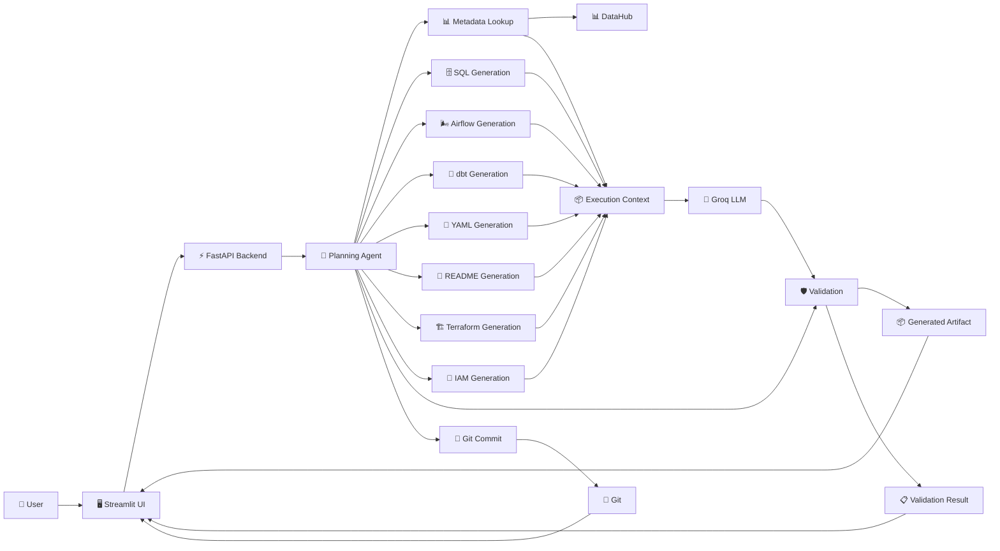

### Architecture Components

| Component | Responsibility |
|---|---|
| **Streamlit Frontend** | Provides the interactive interface for metadata exploration and agent execution. |
| **FastAPI Backend** | Exposes the API and coordinates the agent execution workflow. |
| **Planning Agent** | Interprets the user's request and determines the required execution steps. |
| **Skill System** | Contains modular engineering capabilities such as metadata lookup, generation, validation, and Git operations. |
| **DataHub** | Provides dataset metadata used as context during generation. |
| **Groq LLM** | Provides LLM inference for planning and artifact generation. |
| **Validation Engine** | Checks generated artifacts against artifact-specific validation rules. |
| **IAM Generator** | Generates security policies associated with generated artifacts. |
| **Git Integration** | Optionally commits generated artifacts to Git. |
| **Generated Artifact Store** | Stores generated artifacts under the `generated/` directory. |


## 🧠 Agent Execution Pipeline

Every generation request follows the same high-level process:

```text
Natural-Language Request
        │
        ▼
┌────────────────────┐
│  Planning Agent    │
└─────────┬──────────┘
          │
          ▼
   Execution Plan
          │
          ▼
┌────────────────────┐
│   Skill Executor   │
└─────────┬──────────┘
          │
     ┌────┴─────┐
     ▼          ▼
 Metadata    Generation
 Lookup        Skill
     │          │
     └────┬─────┘
          ▼
      Validation
          │
          ▼
    Delivery / Git
```

The key architectural principle is that the LLM does not directly control the entire application workflow. The planning layer produces a structured execution plan, while the application executes the corresponding skills.

This separation provides clearer control over:

- Which operations are executed
- The order in which they execute
- Validation requirements
- Git operations
- Error handling
- Future skill expansion


## System Workflow

The workflow is dynamically determined by the planning agent.

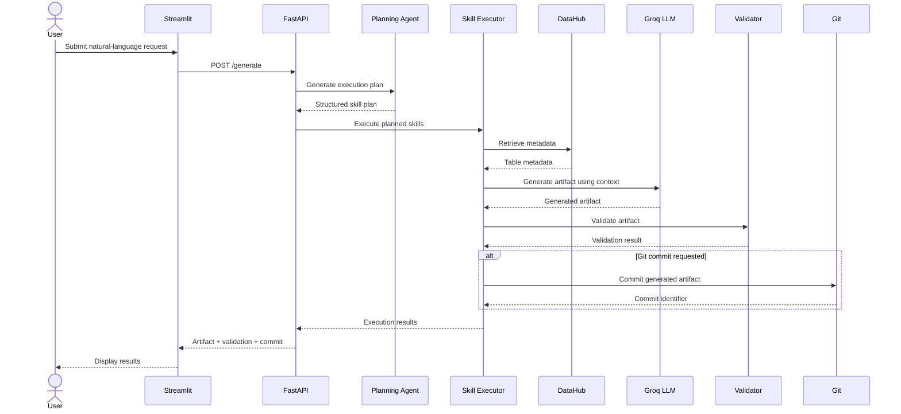

---


## Tech Stack

The AI Data Pipeline Generator is built using a modern, cloud-native technology stack designed for rapid AI development, modularity, scalability, and maintainability.

| Category | Technology | Purpose |
|-----------|------------|---------|
| **Programming Language** | Python | Primary language for backend services and AI orchestration. |
| **Backend Framework** | FastAPI | High-performance REST API framework used to orchestrate pipeline generation. |
| **Frontend** | Streamlit | Interactive web interface for metadata exploration and pipeline generation. |
| **AI / LLM** | Groq API | Generates production-ready data engineering artifacts using metadata-aware prompts. |
| **Metadata Platform** | DataHub | Supplies dataset metadata, schemas, lineage, ownership, and governance information. |
| **Version Control** | Git & GitHub | Source control and collaborative software development. |
| **GitHub Integration** | GitHub Contents API | Uploads generated artifacts directly into repository commits. |
| **Deployment** | Render | Cloud platform hosting the FastAPI backend. |
| **Frontend Hosting** | Streamlit Community Cloud / Local | Hosts the user interface for interacting with the platform. |
| **Validation** | Custom Validation Engine | Verifies generated artifacts before delivery. |
| **Security** | IAM Policy Generator | Produces least-privilege AWS IAM policies alongside generated pipelines. |
| **Packaging** | Python ZipFile | Bundles multiple generated artifacts into downloadable ZIP archives. |
| **Environment Management** | python-dotenv | Secure loading of environment variables and API credentials. |
| **HTTP Client** | Requests | Communicates with external APIs including DataHub, GitHub, and Groq. |
| **Continuous Integration** | GitHub Actions | Executes automated tests and validates code changes before merging. |

### Why These Technologies?

The project intentionally combines technologies commonly used in modern data engineering and cloud-native software development.

- **FastAPI** was selected for its asynchronous performance, automatic OpenAPI documentation, and clean dependency injection model.
- **Streamlit** enables rapid development of an intuitive frontend without requiring a dedicated JavaScript framework.
- **DataHub** provides enterprise metadata that improves the accuracy and relevance of AI-generated artifacts.
- **Groq** offers low-latency inference, enabling fast generation of production-ready pipeline components.
- **GitHub Contents API** enables generated artifacts to be version-controlled immediately after creation.
- **Render** provides a lightweight cloud deployment platform suitable for containerized Python applications.


## Design Decisions

The architecture of the AI Data Pipeline Generator was guided by principles of modularity, maintainability, and production-inspired software engineering. Rather than optimizing solely for rapid prototyping, the project was designed to demonstrate how AI, metadata platforms, cloud-native services, and modern APIs can be integrated into a cohesive data engineering workflow.

### FastAPI Instead of Flask

FastAPI was selected as the backend framework because it provides:

- High-performance asynchronous request handling.
- Automatic OpenAPI documentation.
- Strong type validation using Pydantic.
- Modern dependency injection patterns.
- Excellent support for REST API development.

These capabilities make FastAPI well-suited for orchestrating multiple external services, including DataHub, Groq, and the GitHub API.

---

### Streamlit Instead of a JavaScript Frontend

Rather than introducing a dedicated frontend framework such as React or Vue, Streamlit was chosen to prioritize rapid development and experimentation.

Benefits include:

- Minimal frontend boilerplate.
- Native Python development.
- Fast iteration during AI workflow development.
- Easy deployment for demonstration and portfolio purposes.

This decision allows development effort to focus on backend architecture and AI orchestration rather than frontend complexity.

---

### Metadata-Driven AI Generation

Large Language Models perform significantly better when provided with structured context.

Instead of relying solely on user prompts, the platform retrieves metadata from DataHub, including:

- Dataset schemas
- Column definitions
- Ownership information
- Tags
- Lineage

This metadata is incorporated into prompt construction, enabling the AI to generate artifacts that more closely reflect the underlying data model.

---

### Validation Before Successful Completion

Generated artifacts are not automatically considered successful simply because the LLM returned code.

The agent can include an artifact validation step in the execution plan. The validator applies artifact-specific checks before the workflow is considered successful.

For example, Terraform validation checks for meaningful Terraform configuration blocks such as:

- `resource`
- `module`
- `data`

This provides a deterministic validation layer between AI generation and artifact delivery.

---

### GitHub as the Source of Truth

Generated artifacts can be committed directly to GitHub using the GitHub Contents API.

This approach provides:

- Version history
- Auditability
- Traceability
- Collaboration
- Repository-backed artifact storage

Rather than existing only temporarily within the application, generated outputs become part of a version-controlled software development workflow.

---

### Modular Project Structure

The application is organized into independent modules responsible for:

- Metadata retrieval
- Prompt engineering
- AI generation
- Validation
- Security policy generation
- GitHub integration
- Artifact packaging

This separation of concerns improves maintainability and simplifies future feature development.

---

### Security by Design

Security considerations were incorporated throughout the project.

Examples include:

- Least-privilege IAM policy generation.
- Environment variable management using `.env`.
- GitHub Personal Access Token authentication.
- Validation before artifact delivery.
- Repository-based version control for generated assets.

---

### Cloud-Native Architecture

The application was designed around independently deployable components.

- FastAPI serves backend APIs.
- Streamlit provides the frontend.
- Render hosts backend services.
- GitHub Actions automates continuous integration.
- GitHub serves as the artifact repository.

This modular architecture allows components to evolve independently while remaining loosely coupled.


## Installation

### Prerequisites

Before installing the project, ensure the following software is available on your system.

| Requirement | Recommended Version |
|-------------|---------------------|
| Python | 3.11+ |
| Git | Latest |
| pip | Latest |
| Virtual Environment | venv |
| DataHub (Optional) | Latest |
| GitHub Account | Required for GitHub integration |

---

### Clone the Repository

```bash
git clone https://github.com/pmman-sudo/AI-Data-Pipeline-Generator.git

cd AI-Data-Pipeline-Generator
```

---

### Create a Virtual Environment

Linux / macOS

```bash
python3 -m venv venv

source venv/bin/activate
```

Windows

```powershell
python -m venv venv

venv\Scripts\activate
```

---

### Install Dependencies

```bash
pip install -r requirements.txt
```

---

### Verify Installation

Confirm that the backend dependencies were installed correctly.

```bash
python -c "import fastapi; print('FastAPI Installed')"
```

Confirm the frontend dependencies.

```bash
python -c "import streamlit; print('Streamlit Installed')"
```

---

### Project Setup Complete

Once these steps have completed successfully, continue to the **Configuration** section to configure API keys and environment variables.


## Configuration

The AI Data Pipeline Generator uses environment variables to securely manage API keys, service endpoints, and application configuration.

Create a file named **`.env`** in the project root.

```text
AI-Data-Pipeline-Generator/
├── app/
├── generated/
├── tests/
├── docs/
├── examples/
├── scripts/
├── streamlit_app.py
├── requirements.txt
├── pytest.ini
├── .gitignore
└── .env
```

---

### Example `.env`

```env
# ==============================
# Groq API
# ==============================
GROQ_API_KEY=your_groq_api_key

# ==============================
# GitHub Integration
# ==============================
GITHUB_TOKEN=your_github_personal_access_token

# ==============================
# DataHub
# ==============================
DATAHUB_GMS=http://localhost:8080

# ==============================
# Application
# ==============================
ENVIRONMENT=development
```

---

### Environment Variables

| Variable | Required | Description |
|----------|----------|-------------|
| `GROQ_API_KEY` | ✅ | API key used to generate AI-powered pipeline artifacts. |
| `GITHUB_TOKEN` | ✅ | Personal Access Token used to upload generated artifacts to GitHub. |
| `DATAHUB_GMS` | Optional | URL of the DataHub Metadata Service (GMS). If omitted, metadata write-back is skipped. |
| `ENVIRONMENT` | Optional | Application environment (e.g., `development`, `production`). |

---

### Creating a GitHub Personal Access Token

To enable automatic commits of generated artifacts:

1. Log in to GitHub.
2. Open **Settings → Developer settings → Personal access tokens**.
3. Generate a new token.
4. Grant the required repository permissions.
5. Copy the generated token.
6. Set the token as the value of `GITHUB_TOKEN` in your `.env` file.

---

### Obtaining a Groq API Key

1. Create a Groq account.
2. Generate an API key from the Groq dashboard.
3. Add the key to the `.env` file as:

```env
GROQ_API_KEY=your_api_key
```

---

### Configuring DataHub (Optional)

If a DataHub instance is available, configure the Metadata Service endpoint:

```env
DATAHUB_GMS=http://localhost:8080
```

If no DataHub instance is configured, the application continues to function, but metadata write-back features will be disabled.

---

### Security Best Practices

- Never commit `.env` files to version control.
- Rotate API keys if they are accidentally exposed.
- Use repository secrets for CI/CD pipelines.
- Grant GitHub Personal Access Tokens only the minimum permissions required.
- Store production credentials using your deployment platform's secret management system rather than directly in source code.

## Running the Application

Once the project has been installed and configured, start the backend and frontend services.

---

### Step 1 — Start the FastAPI Backend

From the project root, run:

```bash
uvicorn app.main:app --reload
```

The backend will be available at:

```
http://localhost:8000
```

Interactive API documentation can be accessed at:

```
http://localhost:8000/docs
```

Alternative OpenAPI documentation:

```
http://localhost:8000/redoc
```

---

### Step 2 — Start the Streamlit Frontend

Open a second terminal window.

Activate the virtual environment if it is not already active.

Run:

```bash
streamlit run streamlit_app.py
```

The frontend will be available at:

```
http://localhost:8501
```

---

### Step 3 — Verify Backend Connectivity

When the Streamlit application loads, it automatically checks the backend health endpoint.

A successful connection displays:

```
✅ Backend Connected
```

If the backend is unavailable, the application displays:

```
❌ Cannot connect to FastAPI backend
```

Ensure the FastAPI server is running before using the frontend.

---

### Step 4 — Generate a Pipeline

1. Enter the target DataHub table name.

Example:

```
fct_users_created
```

2. Select an artifact type.

Available options include:

- Generate Complete Pipeline
- Airflow DAG
- SQL
- dbt
- YAML
- README

3. Describe the pipeline to generate.

Example:

```
Generate an Airflow DAG that ingests the
fct_users_created table every day at midnight.
```

4. Click **Generate Pipeline**.

---

### Step 5 — Review the Results

After generation completes, the application displays:

- Generated artifact(s)
- Validation results
- Generated IAM security policy
- GitHub commit hash (if enabled)
- Download link for generated files

For complete pipeline generation, a downloadable ZIP archive containing all generated artifacts is provided.

---

### Expected Startup Architecture

```text
                    User
                      │
                      ▼
          Streamlit Frontend
          http://localhost:8501
                      │
        HTTP Requests │
                      ▼
             FastAPI Backend
          http://localhost:8000
                      │
      ┌───────────────┼────────────────┐
      ▼               ▼                ▼
  DataHub         Groq LLM       GitHub API
      │               │                │
      └───────────────┼────────────────┘
                      ▼
            Generated Artifacts
```

---

### Stopping the Application

To stop either service, press:

```text
Ctrl + C
```

in the corresponding terminal.

---

### Troubleshooting

#### Backend Not Running

Verify that the FastAPI application has started successfully.

```bash
uvicorn app.main:app --reload
```

---

#### Streamlit Cannot Connect

Confirm that:

- FastAPI is running.
- `API_URL` points to the correct backend.
- Firewall settings are not blocking localhost connections.

---

#### GitHub Commits Not Appearing

Verify:

- `GITHUB_TOKEN` is configured.
- The Personal Access Token has repository permissions.
- The configured repository owner and branch are correct.

---

#### DataHub Metadata Unavailable

If DataHub is not running, the application will still generate artifacts using the provided prompt, but metadata-aware generation and metadata write-back features will be unavailable.


## API Reference

The FastAPI backend exposes RESTful endpoints for metadata retrieval, AI-powered artifact generation, health monitoring, and artifact downloads.

The interactive API documentation is automatically generated by FastAPI and is available at:

```
http://localhost:8000/docs
```

Alternative documentation:

```
http://localhost:8000/redoc
```

---

# Base URL

Local Development

```
http://localhost:8000
```

Production (Example)

```
https://your-render-backend.onrender.com
```

---

# Endpoints

## Health Check

Verifies that the backend service is running.

### Request

```http
GET /health
```

### Response

```json
{
  "status": "ok"
}
```

### Status Codes

| Code | Description |
|------|-------------|
| 200 | Backend is healthy |

---

## Retrieve Dataset Metadata

Retrieves metadata for a DataHub dataset.

### Request

```http
GET /schema/{table_name}
```


## Example Usage

The following example demonstrates a complete workflow using the AI Data Pipeline Generator.

---

### Scenario

A data engineer wants to generate a production-ready Airflow pipeline for the `fct_users_created` dataset stored in DataHub.

---

### Step 1 — Enter Dataset

In the **Metadata Explorer**, specify the DataHub table.

```
fct_users_created
```

Click **Preview Metadata** to retrieve the dataset schema.

The application displays:

- Column definitions
- Dataset owners
- Tags
- Lineage information

---

### Step 2 — Select Artifact Type

Choose the desired output.

```
Generate Complete Pipeline
```

This generates:

- Airflow DAG
- SQL
- dbt model
- YAML configuration
- README
- IAM Policy
- Validation report
- ZIP package

---

### Step 3 — Enter Prompt

Example prompt:

```text
Generate a production-ready Airflow DAG that ingests the
fct_users_created table every day at midnight.

Include retries, logging, monitoring,
and best practices for production deployment.
```

---

### Step 4 — Generate Pipeline

Click:

```
🚀 Generate Pipeline
```

The backend performs the following operations:

1. Retrieves metadata from DataHub.
2. Constructs a metadata-aware prompt.
3. Sends the prompt to the Groq LLM.
4. Validates generated artifacts.
5. Generates an IAM security policy.
6. Packages the artifacts.
7. Uploads the artifacts to GitHub (if enabled).

---

### Example Response

```text
✅ Pipeline generated successfully

Generated Artifact
generated/fct_users_created_pipeline.zip

Validation
PASS

Git Commit
430c9a4
```

---

### Example Generated Artifacts

```text
generated/

├── airflow/
│   └── fct_users_created_dag.py
│
├── sql/
│   └── fct_users_created.sql
│
├── dbt/
│   └── fct_users_created.sql
│
├── yaml/
│   └── pipeline.yaml
│
├── readme/
│   └── README.md
│
├── iam_policies/
│   └── fct_users_created_policy.json
│
├── validation/
│   └── validation.json
│
└── fct_users_created_pipeline.zip
```

---

### Example Validation Output

```json
{
  "status": "pass",
  "details": "5 artifacts generated successfully."
}
```

---

### Example GitHub Commit

```text
430c9a4
```

The generated artifacts are committed directly to the configured GitHub repository, providing version history and traceability.

---

### Alternative Example Prompts

#### Generate SQL

```text
Generate SQL that counts new users created each day.
```

---

#### Generate dbt Model

```text
Generate a dbt model for the
fct_users_created table using best practices.
```

---

#### Generate Airflow DAG

```text
Generate a production-ready Airflow DAG
scheduled to run every day at midnight.
```

---

#### Generate YAML Configuration

```text
Generate a YAML configuration
for the pipeline deployment.
```

---

#### Generate Project Documentation

```text
Generate comprehensive project documentation
for this data pipeline.
```

---

### Expected Outputs

Depending on the selected artifact type, the application may produce:

| Artifact | Description |
|----------|-------------|
| Airflow DAG | Production-ready workflow orchestration |
| SQL | Analytics or transformation queries |
| dbt Model | dbt-compatible SQL model |
| YAML | Configuration files |
| README | Automatically generated documentation |
| IAM Policy | Least-privilege AWS security policy |
| Validation Report | Validation status and details |
| ZIP Package | Bundled artifacts for download |
| GitHub Commit | Commit SHA for uploaded artifacts |


## 📸 Screenshots

### 1. Dashboard


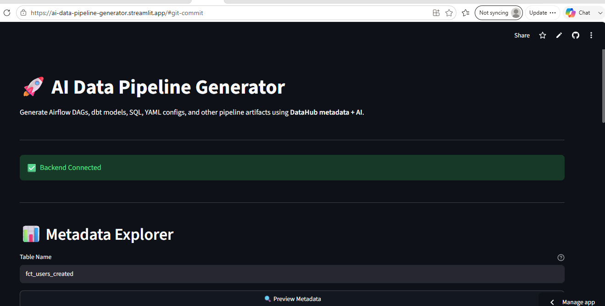


The main interface of the AI Data Pipeline Generator showing backend connectivity, and metadata exploration.


---


### 2. Metadata Explorer


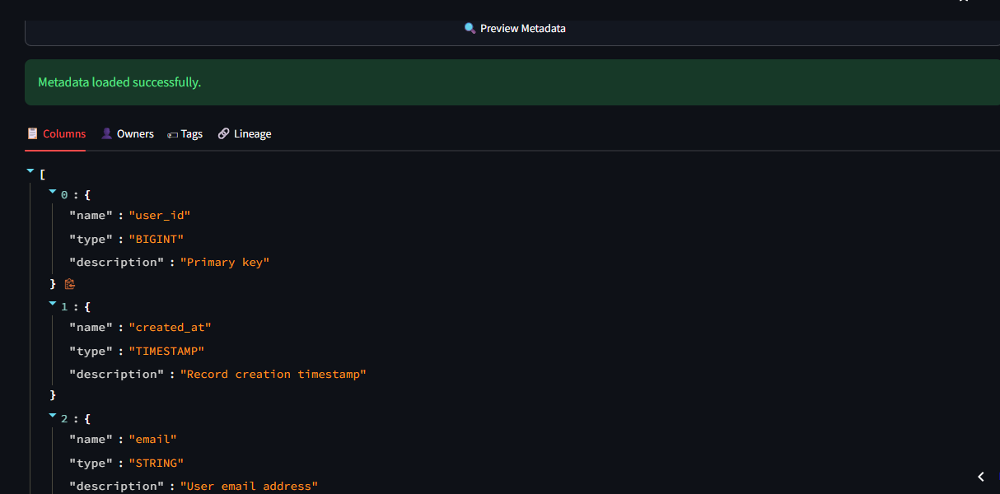


Browse available DataHub metadata and select a dataset before generating pipeline artifacts.


---


### 3. AI Pipeline Generation


#### Generation Request


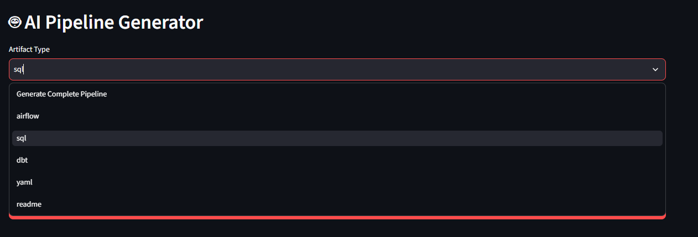


Users specify the desired artifact type and provide natural language instructions for the AI generation engine.


#### Generated Pipeline


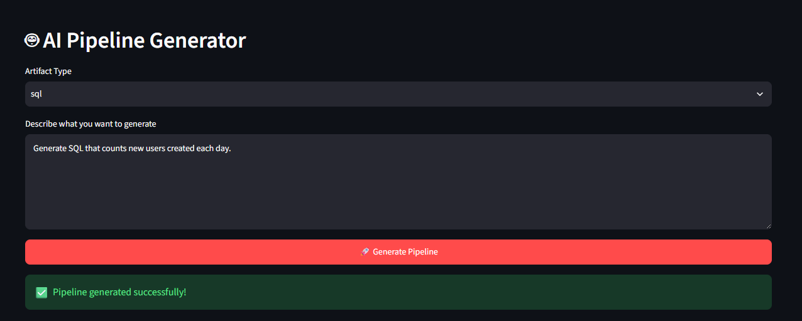


The platform produces production-ready Airflow DAGs, dbt models, SQL scripts, IAM policies, YAML configurations, and supporting artifacts.


---


### 4. Generation Results


#### Validation Summary


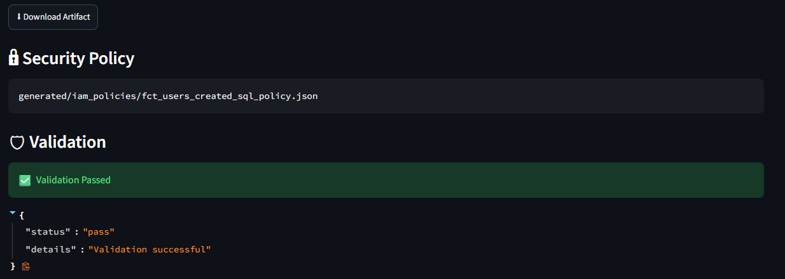


Generated artifacts are validated to ensure correctness and production readiness.


#### Generated Artifacts


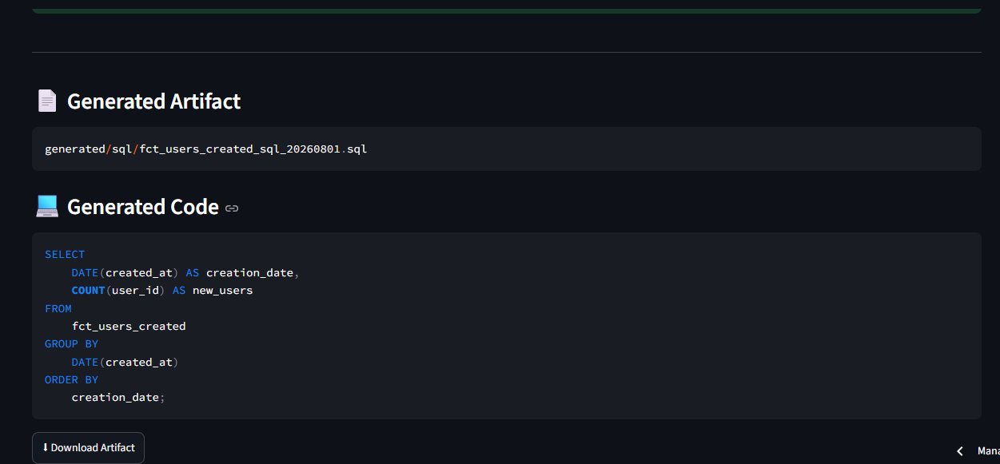


Users can inspect every generated file before deployment.


---


### 5. Download Generated Package


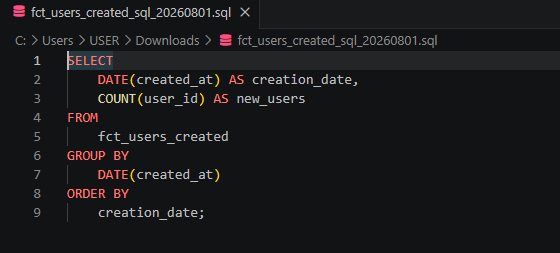


Download the complete generated pipeline package as a ZIP archive for immediate use.


---


### 6. GitHub Integration


#### Automatic Commit


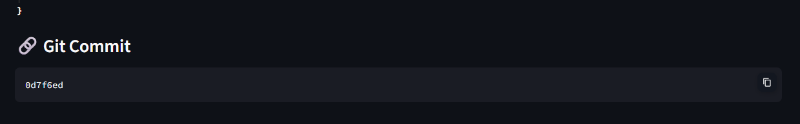


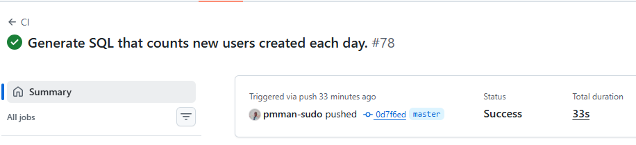

Generated artifacts are automatically committed to the configured GitHub repository using the GitHub Contents API.


#### Repository History


Each generation creates a traceable commit, providing version control and collaboration capabilities.


---


### 7. Interactive API Documentation


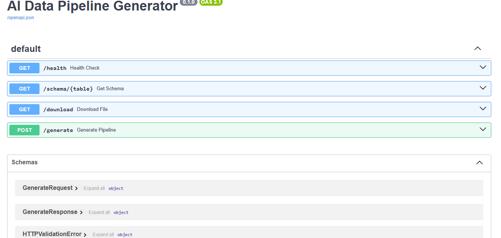


FastAPI automatically generates interactive Swagger UI documentation for exploring and testing every API endpoint.


## 📁 Project Structure

```text
AI-Data-Pipeline-Generator/
│
├── app/                             # Core backend application
│   ├── datahub/                     # DataHub metadata integration
│   ├── github/                      # GitHub Contents API integration
│   ├── llm/                         # LLM generation engine
│   ├── prompts/                     # Prompt templates for AI generation
│   ├── security/                    # Validation and security utilities
│   ├── utils/                       # Shared helper functions
│   └── main.py                      # FastAPI application entry point
│
├── generated/                       # Generated pipeline artifacts
│   ├── airflow/                     # Airflow DAGs
│   ├── configs/                     # YAML and configuration files
│   ├── dbt/                         # dbt models
│   ├── iam_policies/                # Least-privilege IAM policies
│   ├── sql/                         # Generated SQL scripts
│   ├── customer_orders_pipeline_*/  # Example generated pipelines
│   └── fct_users_created_pipeline_*/
│
├── docs/
│   └── images/                      # README images and documentation assets
│
├── tests/                           # Automated unit tests
│
├── .github/
│   └── workflows/                   # GitHub Actions CI/CD workflows
│
├── streamlit_app.py                 # Streamlit frontend
├── requirements.txt                 # Python dependencies
├── docker-compose.quickstart.yml    # Docker deployment
├── pytest.ini                       # Pytest configuration
├── README.md                        # Project documentation
└── LICENSE                          # Apache License 2.0
```

### Directory Overview

| Directory | Purpose |
|-----------|---------|
| **app/** | Contains the FastAPI backend, AI generation engine, DataHub integration, GitHub API client, prompt templates, and supporting utilities. |
| **generated/** | Stores AI-generated artifacts, including Airflow DAGs, dbt models, SQL scripts, IAM policies, configuration files, and downloadable pipeline packages. |
| **docs/** | Documentation resources, screenshots, diagrams, and images used throughout the README. |
| **tests/** | Automated unit tests that verify application behavior and maintain code quality. |
| **.github/workflows/** | GitHub Actions workflows for continuous integration and automated testing. |

### Key Entry Points

| File | Description |
|------|-------------|
| **streamlit_app.py** | Launches the interactive Streamlit web application used by end users. |
| **app/main.py** | Starts the FastAPI backend and exposes the REST API endpoints. |
| **requirements.txt** | Lists all Python packages required to run the application. |
| **docker-compose.quickstart.yml** | Provides a quick Docker-based deployment configuration. |
| **README.md** | Comprehensive project documentation, installation guide, and developer reference. |


## 🔒 Security

Security is a first-class concern throughout the AI Data Pipeline Generator. The platform follows secure-by-default principles to ensure generated artifacts, credentials, and integrations meet production standards.

### Security Features

- **GitHub Personal Access Token Authentication**
  - Uses GitHub's REST Contents API with Personal Access Tokens.
  - Credentials are loaded securely through environment variables.
  - Tokens are never hardcoded into the source code.

- **Environment Variable Management**
  - Sensitive configuration values are stored in a local `.env` file.
  - Environment variables are excluded from version control using `.gitignore`.
  - Secrets remain isolated from generated artifacts.

- **Least-Privilege IAM Policy Generation**
  - Automatically generates AWS IAM policies following the principle of least privilege.
  - Policies grant only the permissions required by the generated pipeline.

- **Artifact Validation**
  - Generated artifacts are validated before packaging.
  - Validation checks include:
    - File existence
    - Syntax verification
    - Required artifact generation
    - Pipeline completeness

- **GitHub Version Control**
  - Generated artifacts can be committed directly to GitHub.
  - Every generation produces a traceable commit history.
  - Existing files are updated safely using GitHub's SHA-based versioning.

- **Secure API Design**
  - FastAPI automatically validates request models.
  - Structured exception handling prevents unexpected failures.
  - REST endpoints follow predictable request and response schemas.

- **CI Security Checks**
  - GitHub Actions automatically execute unit tests on every push.
  - Failed validations prevent broken code from being merged.

---

### Protected Secrets

The following values should always be configured as environment variables and must never be committed to source control.

| Environment Variable | Purpose |
|----------------------|---------|
| `OPENAI_API_KEY` | OpenAI API authentication |
| `GITHUB_TOKEN` | GitHub Contents API authentication |
| `DATAHUB_GMS` | DataHub metadata server |
| `DATAHUB_TOKEN` *(optional)* | DataHub authentication |

---

### Security Best Practices

- Never commit API keys or tokens to Git.
- Rotate GitHub Personal Access Tokens regularly.
- Use repository secrets when deploying with GitHub Actions.
- Grant the minimum IAM permissions required for generated pipelines.
- Review generated IAM policies before deploying to production.
- Keep dependencies updated to receive security patches.

---

The project is designed to support secure development workflows while remaining suitable for experimentation, local development, and production deployments.


## ✅ Validation

To improve reliability and reduce deployment errors, every generated artifact passes through an automated validation pipeline before it is packaged or committed.

The validation framework ensures that generated pipelines are complete, syntactically correct, and ready for downstream use.

### Validation Pipeline

Each generation request follows the validation workflow below:

1. AI generates the requested artifacts.
2. Required files are verified.
3. Generated code is validated.
4. Configuration files are inspected.
5. IAM policies are generated and checked.
6. Validation results are recorded.
7. Artifacts are packaged into a downloadable ZIP archive.
8. Optionally, artifacts are committed to GitHub.

---

### Validation Checks

| Validation | Description |
|------------|-------------|
| Artifact Existence | Ensures every required output file was generated successfully. |
| Pipeline Completeness | Confirms all expected project components are present. |
| Configuration Validation | Checks generated configuration files for completeness. |
| IAM Policy Validation | Ensures security policies are generated correctly. |
| Packaging Validation | Confirms generated artifacts are successfully packaged into a ZIP archive before download. |
| GitHub Commit Validation | Verifies artifacts can be committed successfully using the GitHub Contents API. |

---

### Validation Status

Validation results are returned as structured JSON.

Example:

```json
{
    "status": "pass",
    "details": "5 artifacts generated successfully."
}
```

The frontend displays validation feedback immediately after generation, allowing users to identify potential issues before deployment.

---

### Failure Handling

If validation fails:

- Artifact packaging is halted.
- Validation errors are returned through the API.
- The frontend displays the failure reason.
- Invalid artifacts are not committed to GitHub.

This approach prevents incomplete or inconsistent pipeline artifacts from being distributed.

---

### Design Philosophy

Validation is integrated into the generation workflow rather than treated as an optional post-processing step. Every generated project is evaluated before it is packaged, downloaded, or version-controlled, providing greater confidence in the generated output.


## 🚀 Deployment

The AI Data Pipeline Generator is designed to support multiple deployment environments, ranging from local development to cloud-hosted production deployments.


## Docker Deployment

The project includes a Docker Compose configuration for rapid deployment.

Start the application stack:

```bash
docker compose -f docker-compose.quickstart.yml up --build
```

Stop the application:

```bash
docker compose down
```

Docker provides a consistent development environment without requiring manual dependency installation.

---

## Render Deployment

The backend can be deployed on Render as a FastAPI Web Service.

### Deployment Steps

1. Fork or clone the repository.
2. Create a new Render Web Service.
3. Connect the GitHub repository.
4. Configure the Build Command:

```bash
pip install -r requirements.txt
```

5. Configure the Start Command:

```bash
uvicorn app.main:app --host 0.0.0.0 --port $PORT
```

6. Configure the required environment variables:

| Variable | Description |
|----------|-------------|
| OPENAI_API_KEY | OpenAI authentication |
| GITHUB_TOKEN | GitHub Contents API |
| DATAHUB_GMS | DataHub Metadata Server |
| DATAHUB_TOKEN *(optional)* | DataHub authentication |

Deploy the service.

---

## Production Considerations

For production deployments, consider the following recommendations:

- Store all secrets using your cloud provider's secret management solution.
- Rotate API tokens periodically.
- Enable HTTPS for all public endpoints.
- Monitor application logs and API performance.
- Configure automated backups for metadata services.
- Restrict IAM permissions using the generated least-privilege policies.
- Enable CI/CD pipelines for automated testing before deployment.

---

## Supported Deployment Targets

| Platform | Status |
|----------|--------|
| Local Development | ✅ Supported |
| Docker | ✅ Supported |
| Render | ✅ Supported |
| GitHub Actions | ✅ Supported |
| Linux Servers | ✅ Supported |
| Windows | ✅ Supported |
| macOS | ✅ Supported |


## ⚙️ Continuous Integration & Continuous Deployment (CI/CD)

The AI Data Pipeline Generator uses **GitHub Actions** to automatically validate every code change before it is merged or deployed.

The CI pipeline ensures that new contributions maintain the project's reliability, code quality, and functionality.

---

### Automated Workflow

Every push and pull request automatically triggers the CI pipeline.

```text
Developer Push / Pull Request
            │
            ▼
     GitHub Actions
            │
            ├──► Install Dependencies
            │
            ├──► Run Automated Tests
            │
            ├──► Run Security Checks
            │
            └──► Report Workflow Status
```

---

### CI Pipeline

The automated workflow performs the following tasks:

- Install project dependencies
- Execute automated unit tests using Pytest
- Validate generated pipeline artifacts
- Verify GitHub integration
- Detect failed builds before merging
- Generate detailed workflow logs

---

### GitHub Actions

The workflow configuration is located in:

```text
.github/workflows/
```

GitHub Actions automatically runs on:

- Every push to the repository
- Every Pull Request
- Manual workflow execution (when configured)

---

### Build Status

Every workflow produces a complete execution report including:

- Dependency installation
- Test execution
- Validation results
- Build duration
- Success or failure status

If any stage fails, the workflow immediately stops and reports the error.

---

### Benefits

Continuous Integration provides several advantages:

- Detects bugs early in development
- Prevents broken code from being merged
- Maintains consistent code quality
- Automatically validates generated artifacts
- Improves deployment reliability
- Encourages collaborative development

---

### Future Enhancements

The CI/CD pipeline can be extended with:

- Automated Docker image publishing
- Deployment to cloud environments
- Code coverage reporting
- Static security analysis
- Dependency vulnerability scanning
- Automated release generation
- Version tagging
- Performance benchmarking


## 🗺️ Roadmap

The AI Data Pipeline Generator is under active development. The roadmap below outlines planned improvements and long-term goals for the project.

---

### ✅ Current Features
- AI-powered pipeline generation using natural language.
- Metadata-aware generation using DataHub.
- Airflow DAG generation.
- dbt model generation.
- SQL generation.
- YAML configuration generation.
- README generation.
- Terraform generation.
- AWS IAM policy generation.
- Artifact validation.
- GitHub integration.
- Automatic ZIP packaging.
- Streamlit frontend.
- FastAPI REST API.
- Interactive Swagger API documentation.
- GitHub Actions CI workflow.

---

### 🚧 In Progress

- Improved prompt engineering for more accurate pipeline generation
- Enhanced validation rules for generated artifacts
- Better error reporting and logging
- Additional metadata compatibility improvements
- Performance optimization for large metadata schemas

---

### 🔜 Planned Features

#### Multi-Cloud Support

- Azure Data Factory pipeline generation
- Google Cloud Dataflow templates
- AWS Glue Job generation

---

#### Additional Pipeline Frameworks

- Apache Spark jobs
- Apache Beam pipelines
- Dagster pipelines
- Prefect workflows

---

#### Infrastructure as Code

- Terraform modules
- AWS CloudFormation templates
- Kubernetes deployment manifests
- Helm Charts

---

#### Enterprise Features

- User authentication
- Project workspaces
- Artifact version history
- Team collaboration
- Audit logging
- Role-based access control (RBAC)

---

#### AI Improvements

- Support for multiple LLM providers
- Prompt optimization
- Pipeline explanation generation
- Automated documentation generation
- Pipeline optimization recommendations

---

#### Developer Experience

- CLI interface
- VS Code Extension
- Plugin architecture
- Template marketplace
- Custom prompt library

---

### 🎯 Long-Term Vision

The long-term goal of this project is to become an AI-powered platform capable of generating complete, production-ready data engineering solutions from metadata and natural language requirements.

Rather than generating isolated code snippets, the platform aims to automate the creation of complete data platforms, including ingestion, transformation, orchestration, security, deployment, validation, monitoring, and documentation.

The vision is to reduce the time required to build production-grade data pipelines from days or weeks to just a few minutes while following industry best practices.


## 📄 License

This project is licensed under the Apache License 2.0.

See the [LICENSE](LICENSE) file for details.